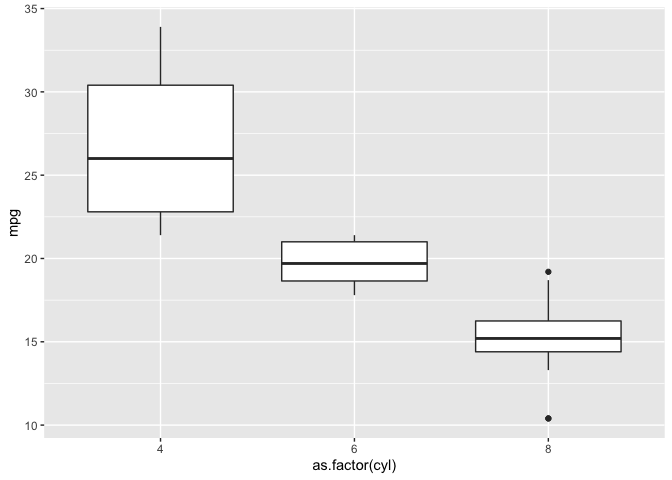
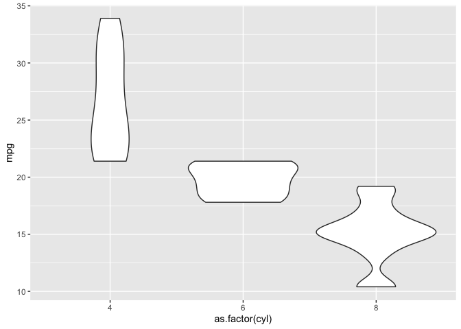
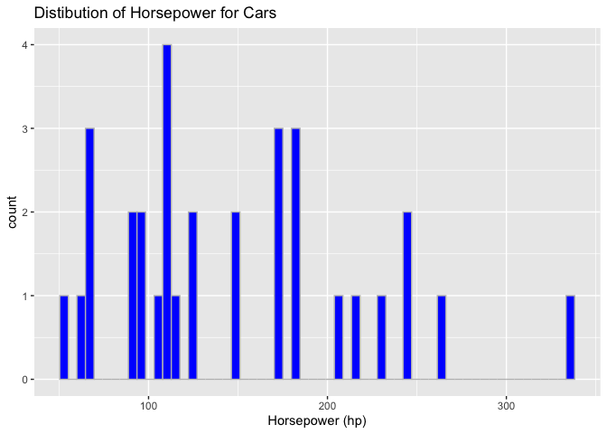
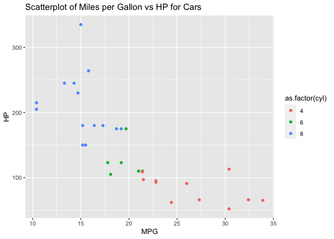
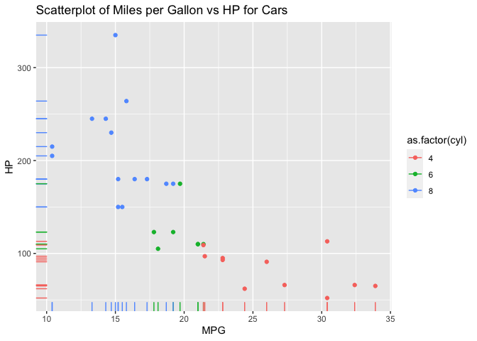
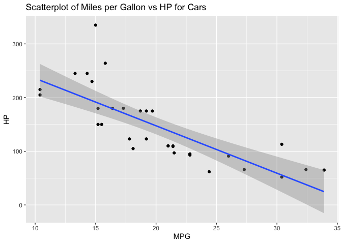
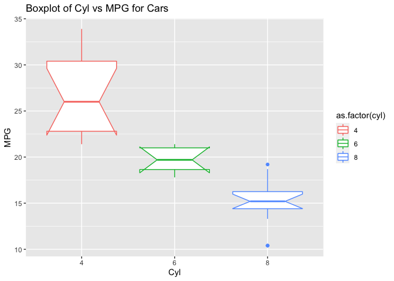
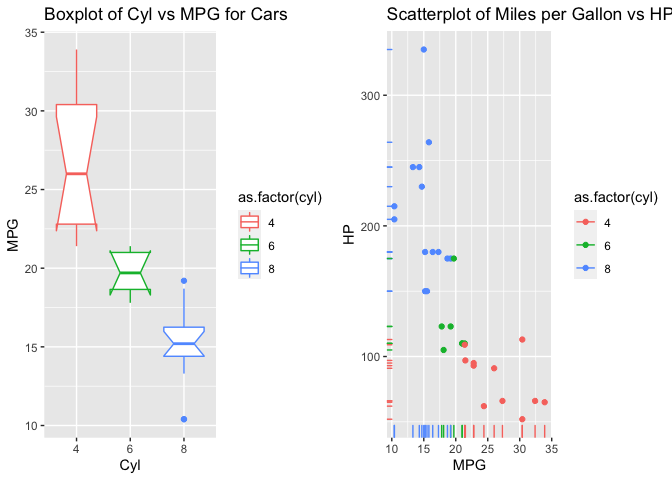
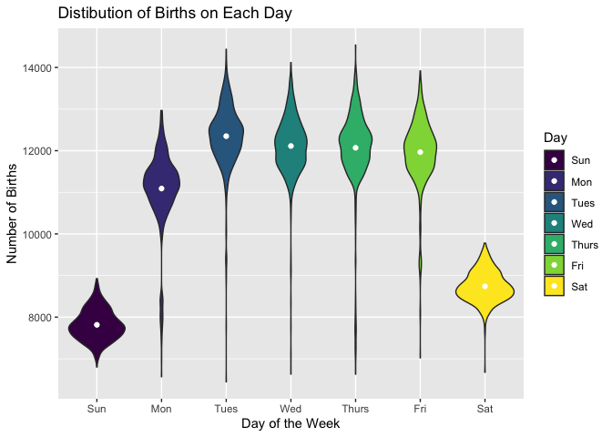

## R Practice

<https://jayholster.shinyapps.io/DataVisualizationAssessment/#section-assessment>

This is an R Markdown document. Markdown is a simple formatting syntax
for authoring HTML, PDF, and MS Word documents. For more details on
using R Markdown see <http://rmarkdown.rstudio.com>.

When you click the **Knit** button a document will be generated that
includes both content as well as the output of any embedded R code
chunks within the document. You can embed an R code chunk like this:

``` r
library(tidyverse)
```

    ## ── Attaching packages ─────────────────────────────────────── tidyverse 1.3.1 ──

    ## ✓ ggplot2 3.3.3     ✓ purrr   0.3.4
    ## ✓ tibble  3.1.0     ✓ dplyr   1.0.7
    ## ✓ tidyr   1.1.3     ✓ stringr 1.4.0
    ## ✓ readr   1.4.0     ✓ forcats 0.5.1

    ## ── Conflicts ────────────────────────────────────────── tidyverse_conflicts() ──
    ## x dplyr::filter() masks stats::filter()
    ## x dplyr::lag()    masks stats::lag()

``` r
qplot(data = mtcars, x = as.factor(cyl), y= mpg, geom = 'boxplot')
```



## Violin Plots with qplot

``` r
library(tidyverse)
qplot(data = mtcars, x = as.factor(cyl), y= mpg, geom = 'violin')
```



``` r
ggplot(data = mtcars, aes(x = as.factor(cyl), y = mpg)) + 
  geom_violin()
```


``` r
ggplot(data = mtcars, aes(x = hp)) + 
  geom_histogram(bins = 60, color = 'grey', fill = 'blue') + 
  ggtitle("Distibution of Horsepower for Cars") + 
  xlab("Horsepower (hp)") 
```



``` r
ggplot(data = mtcars, aes(x = mpg, y = hp, color = as.factor(cyl))) + 
  geom_point() + 
  ggtitle("Scatterplot of Miles per Gallon vs HP for Cars") + 
  xlab("MPG") + ylab("HP")
```



``` r
ggplot(data = mtcars, aes(x = mpg, y = hp, color = as.factor(cyl))) + 
  geom_point() + geom_rug() +
  ggtitle("Scatterplot of Miles per Gallon vs HP for Cars") + 
  xlab("MPG") + ylab("HP")
```



``` r
ggplot(data = mtcars, aes(x = mpg, y = hp)) + 
  geom_point() + geom_smooth(method = 'lm') +
  ggtitle("Scatterplot of Miles per Gallon vs HP for Cars") + 
  xlab("MPG") + ylab("HP")
```

    ## `geom_smooth()` using formula 'y ~ x'



``` r
ggplot(data = mtcars, aes(x = as.factor(cyl), y = mpg, color = as.factor(cyl))) + 
  geom_boxplot(notch = T) +
  ggtitle("Boxplot of Cyl vs MPG for Cars") + 
  xlab("Cyl") + ylab("MPG")
```

    ## notch went outside hinges. Try setting notch=FALSE.
    ## notch went outside hinges. Try setting notch=FALSE.



``` r
library(tidyverse)
library(ggpubr)
plot1 <- ggplot(data = mtcars, aes(x = as.factor(cyl), y = mpg, color = as.factor(cyl))) + 
  geom_boxplot(notch = T) +
  ggtitle("Boxplot of Cyl vs MPG for Cars") + 
  xlab("Cyl") + ylab("MPG")
  
plot2 <- ggplot(data = mtcars, aes(x = mpg, y = hp, color = as.factor(cyl))) + 
  geom_point() + geom_rug() +
  ggtitle("Scatterplot of Miles per Gallon vs HP for Cars") + 
  xlab("MPG") + ylab("HP")

ggarrange(plot1,plot2,ncol=2)
```

    ## notch went outside hinges. Try setting notch=FALSE.
    ## notch went outside hinges. Try setting notch=FALSE.



## Final assessment

``` r
library(tidyverse)
library(fivethirtyeight)
```

    ## Some larger datasets need to be installed separately, like senators and
    ## house_district_forecast. To install these, we recommend you install the
    ## fivethirtyeightdata package by running:
    ## install.packages('fivethirtyeightdata', repos =
    ## 'https://fivethirtyeightdata.github.io/drat/', type = 'source')

``` r
data <- US_births_1994_2003

data_grouped <- group_by(data, day_of_week, year)
data_max_day_year <- filter(data_grouped, births==max(births))


ggplot(data_grouped, aes(x = day_of_week, y = births, fill = day_of_week)) +
  geom_violin() + 
  ggtitle("Distibution of Births on Each Day") + 
  xlab("Day of the Week") + ylab("Number of Births") + stat_summary(fun = mean, geom = "point", color = 'white') + labs(fill='Day') 
```



## 
